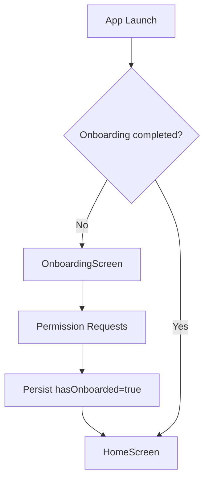
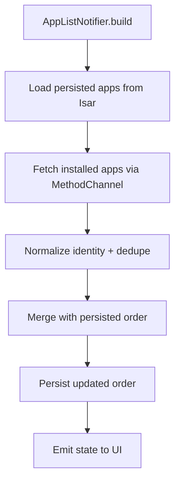
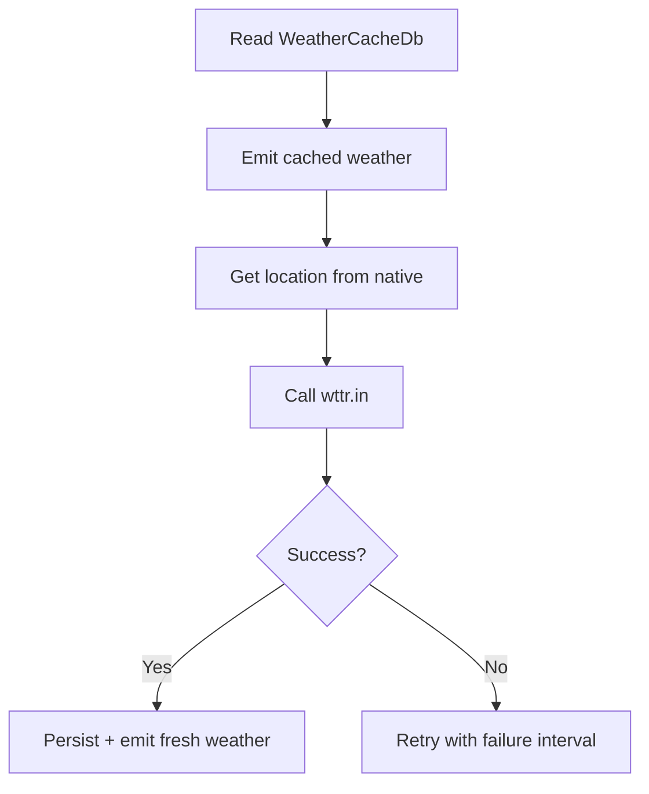

# Stillmax Launcher — Practical Implementation Report

> Project: **Stillmax** (Android Launcher)
> 
> Current app version: **0.1.15+15** (`pubspec.yaml`)
> 
> Repository: **https://github.com/viveksharma2105/stillmax**

---

## 1. Project Overview

### 1.1 What this project is
Stillmax is a custom Android launcher built with **Flutter** for UI and **native Android Java** for system-level integrations. It replaces the default home screen and provides a cinematic, glassmorphic launcher experience with practical utilities.

### 1.2 Core objective
Build a launcher that is:
- visually premium (dark, layered, glass style),
- functionally useful (fast app launch, search, widgets, media controls),
- technically robust (state management + persistent local data + Android bridge),
- privacy-friendly (local-first, minimal external dependency).

### 1.3 Technology stack
- **Frontend/UI:** Flutter
- **State management:** Riverpod (`flutter_riverpod`)
- **Local database:** Isar
- **Native bridge:** MethodChannel + EventChannel
- **Native Android layer:** Java (`MainActivity`, notification listener service)
- **External data source:** `wttr.in` weather API

### 1.4 High-level capabilities
- Home launcher with favorites and alphabetical app organization
- Swipe app drawer with search
- Wallpaper override + reset
- Notification badges/counts
- Active media session card with controls
- Weather widget with location support
- Android home widget hosting
- Black Box vault (hidden apps + PIN)
- Multi-profile / cloned-app identity support

---

## 2. Problem Framing & Scope

### 2.1 Problems in common launchers
Many stock launchers fail in at least one of these areas:
- Low customization depth
- Weak handling of work-profile/cloned apps
- Fragmented UX across widgets/media/notifications
- Heavy, ad-driven UX in many third-party launchers
- Little emphasis on privacy-first local storage design

### 2.2 Problem statement
Design and implement a production-oriented launcher that combines:
1. smooth UX,
2. reliable app indexing/launching,
3. persistent and reactive state,
4. deep Android integration,
5. maintainable architecture.

### 2.3 Project scope (in)
- Home screen and app drawer
- App indexing, ordering, dock, favorites
- Theme/icon customization support
- Native integrations (wallpaper, media, notifications, widgets, location)
- Hidden-app vault with PIN hash
- Onboarding and permission flow

### 2.4 Project scope (out)
- Cloud sync account system
- Remote telemetry backend
- Cross-device state replication
- ML-based recommendations
- Full accessibility/performance audit across all OEMs (future work)

### 2.5 Constraints
- Android OEM restrictions on Wi-Fi/Bluetooth/system controls
- Permission-dependent features (notifications, location)
- Launcher behavior varies by OEM custom Android skin

---

## 3. Solution Design & Architecture

### 3.1 Architectural style
**Layered local-first architecture**:

```text
Flutter UI (screens + widgets)
        ↓
Riverpod providers/notifiers
        ↓
AppService (Dart channel wrapper)
        ↓
Android MainActivity + Listener Service
        ↓
Android system APIs + services
```

### 3.2 Why this architecture
- Keeps Flutter UI declarative and testable.
- Moves system-coupled code into native layer.
- Keeps app state centralized via Riverpod.
- Uses Isar for durable persistence and fast startup.

### 3.3 Main modules
- `lib/main.dart`: app entry, error logging, onboarding gate
- `lib/state/app_list_provider.dart`: major state and persistence orchestration
- `lib/services/app_service.dart`: platform channel interface
- `lib/screens/*`: launcher UI screens
- `lib/widgets/*`: reusable visual/interaction units
- `android/app/src/main/java/com/stillmax/MainActivity.java`: native method/event handlers
- `android/app/src/main/java/com/stillmax/StillmaxNotificationListenerService.java`: notification/media integration

### 3.4 Data persistence model (Isar collections)
Examples:
- `AppInfoDb`, `DockApp`, `StarredAppDb`
- `SettingsDb`, `IconPackDb`, `CustomAppNameDb`
- `HiddenAppDb`, `BlackBoxSettingsDb`
- `WeatherCacheDb`, `HomeWidgetDb`, `OnboardingDb`

### 3.5 Reactive state model (Riverpod)
Core providers include:
- `appListProvider`
- `displayAppsProvider`
- `settingsProvider`
- `starredAppsProvider`
- `dockAppsProvider`
- `hiddenAppsProvider`
- `wallpaperBytesProvider`
- `mediaSessionProvider`
- `notificationCountsProvider`

---

## 4. UI/UX Design

### 4.1 Design language
Based on the project design system (`DESIGN.md`):
- dark-first “Nocturnal OS” visual style,
- translucent layered surfaces,
- soft gradients and rounded edges,
- high legibility with premium visual hierarchy.

### 4.2 UX principles used
- **Fast glanceability:** time, weather, media, notifications visible without deep navigation.
- **Low interaction friction:** swipe-up drawer, quick launch actions, searchable app list.
- **Consistency:** repeated glass components and shared spacing/radius tokens.
- **Progressive onboarding:** permission prompts delayed to relevant step.

### 4.3 Main screens
- **OnboardingScreen**: intro, set home app, permissions
- **HomeScreen**: clock/header, favorites, side alphabet navigation
- **AppDrawer**: grouped app list + search
- **StillmaxSettingsScreen**: launcher customization controls
- **Black Box screens**: secure hidden-app entry and vault view

### 4.4 Interaction patterns
- Swipe gestures for drawer transitions
- Alphabet sidebar for quick navigation
- Long-press/context style app actions
- Widget slot assignment in header region

### 4.5 UX tradeoffs
- Rich visuals can cost GPU time on low-end devices.
- Permission-heavy onboarding may reduce first-run completion.
- OEM policy differences can produce inconsistent behavior.

---

## 5. Feature Implementation Breakdown

### 5.1 Feature matrix

| Feature | Implementation Area | Storage | Native Dependency |
|---|---|---|---|
| App listing + launch | `app_list_provider.dart`, `app_service.dart`, `MainActivity.java` | `AppInfoDb` | LauncherApps, PackageManager |
| Favorites/Starred | `StarredAppsNotifier` | `StarredAppDb` | No |
| Dock | `DockAppsNotifier` | `DockApp` | No |
| Hidden apps (Black Box) | `HiddenAppsNotifier`, Black Box screens | `HiddenAppDb`, `BlackBoxSettingsDb` | App launch integration |
| Wallpaper management | `wallpaperBytesProvider`, `WallpaperNotifier` | file cache + local override | WallpaperManager |
| Weather widget | `weather_widget.dart`, `AppService` | `WeatherCacheDb` | Location + HTTP |
| Media controls | `mediaSessionProvider` + notification listener service | transient + cache | MediaSessionManager |
| Notification badges/counts | provider polling + listener service | transient | NotificationListenerService |
| Android widgets | widget picker + platform view | `HomeWidgetDb`, settings slots | AppWidgetHost/AppWidgetManager |

### 5.2 App indexing and identity logic
- Uses composite identity (`package`, `userSerial`, `userUid`, `instanceId`, `className`) to avoid collisions.
- Supports cloned/work-profile variants.
- Persists ordering in Isar for stable UI order.

### 5.3 Search and grouping
- Drawer and grouped app providers produce alphabetical sections.
- Non-letter entries grouped under fallback bucket.

### 5.4 Black Box workflow
- Set 6-digit PIN.
- Store SHA-256 hash only.
- Hidden apps excluded from visible app providers.
- Vault unlock required to view/launch/unhide.

### 5.5 Widget pipeline
- List available widgets from native.
- Allocate widget ID.
- Bind and configure widget provider.
- Persist widget metadata.
- Render with platform views in Flutter UI.

---

## 6. Custom Logic / Intelligence Layer

This project does not include ML inference, but contains strong **rule-based intelligence** in state and caching layers.

### 6.1 Identity normalization intelligence
- `buildAppIdentityKey` and parser normalize multiple app identity formats.
- Backward compatibility for old and new identity encodings.
- Prevents duplicate app entries across profiles.

### 6.2 Intelligent fallback logic
- If installed app fetch fails, fallback to persisted app list.
- If wallpaper fetch fails, fallback to cached bytes.
- If weather fetch fails, use last known cached weather.

### 6.3 Smart refresh behavior
- App list refresh triggered by package-change events.
- Media provider emits only on meaningful payload change.
- Weather refresh interval adapts by success/failure.

### 6.4 Data quality safeguards
- Byte-size guards on wallpapers.
- Null-safe conversions from platform channels.
- Defensive try/catch around native boundaries.
- Reindexing/reorder persistence safeguards in notifiers.

### 6.5 Lightweight prediction-like behavior
- Location-name caching with staleness/movement threshold.
- Media art cache keyed by metadata and bitmap generation.
- Avoids expensive recomputation/render churn.

---

## 7. Backend & Integration

### 7.1 Backend reality of this project
There is **no traditional cloud backend**. Architecture is **device-local first**.

### 7.2 Integration points
1. **Android System APIs** via `MainActivity`:
   - launcher app discovery/launch
   - wallpaper APIs
   - quick setting toggles
   - app widgets
   - location services
2. **Notification listener service**:
   - active notification packages
   - notification counts
   - active media session metadata/control
3. **External HTTP integration**:
   - weather from `wttr.in`

### 7.3 Platform channel contract
- Method channel: `com.stillmax/app_service`
- Event channels:
  - `com.stillmax/app_events`
  - `com.stillmax/home_events`

### 7.4 Integration robustness
- Uses typed model mapping in Dart (`AppInfo`, `LatLng`, etc.).
- Handles permission denial and platform exceptions gracefully.
- Includes multiple fallback paths for launcher and app detail operations.

### 7.5 Security + permission posture
Requested permissions cover launcher-specific needs:
- app discovery, wallpaper, notifications, location, widgets, settings writes.
- risk handled by local processing and minimal external data transfer.

---

## 8. Data Visualization & Insights

### 8.1 Visualization style in this app
Stillmax emphasizes **ambient operational visualization**, not chart dashboards.

### 8.2 Existing insight surfaces
- **Notification counts** shown at app level.
- **Media card** presents track/artist/play state.
- **Weather card** shows location + condition + temperature.
- **Alphabetic grouping** provides cognitive map of app inventory.

### 8.3 Why this is still data visualization
These UI cards convert raw system data into immediate, glance-friendly decisions:
- “Do I have unread messages?”
- “What is playing now?”
- “What weather context do I have before opening maps?”

### 8.4 Proposed future visualization enhancements
- Weekly notification trend mini-chart by app
- App open-frequency heatmap (local only)
- Battery/brightness historical micro-sparklines
- Weather trend strip (next 6 hours)

---

## 9. Testing & Validation

### 9.1 Automated checks executed
Commands run in current workspace:

```bash
flutter test
flutter analyze
```

### 9.2 Current results
- `flutter test`: **passed** (1/1)
- `flutter analyze`: **No issues found**

### 9.3 Current coverage status
- Existing test suite is minimal (`test/widget_test.dart` basic app existence).
- Functional confidence currently depends heavily on manual device testing.

### 9.4 Manual validation checklist (recommended)
- [ ] Set app as default launcher and verify HOME intent behavior
- [ ] Verify onboarding permission prompts
- [ ] Launch/uninstall/open info from app tiles
- [ ] Add/remove/reorder starred and dock apps
- [ ] Hide/unhide apps via Black Box
- [ ] Validate wallpaper set/reset + cache fallback
- [ ] Validate weather with permission allowed/denied
- [ ] Validate media controls with Spotify/YouTube Music
- [ ] Validate widget add/configure/remove flow
- [ ] Validate work-profile app identity correctness

### 9.5 Negative-path tests to add
- Notification listener disabled
- Location unavailable / GPS off
- Widget bind cancelled mid-flow
- Wallpaper source image too large/corrupt
- Package added/removed during app usage

---

## 10. Performance & Optimization

### 10.1 Existing optimizations
- Local Isar cache for startup speed
- Partial refresh instead of full reload when possible
- Byte-size limits for wallpaper payloads
- Media payload diffing to reduce unnecessary UI updates
- Weather and location caching with TTL-style behavior

### 10.2 Memory/perf risk areas
- Large single provider file (`app_list_provider.dart`) complexity
- Potential heavy icon/image operations
- Platform view overhead for embedded widgets
- Polling intervals for notification/media/weather

### 10.3 Practical optimization roadmap
1. Split large provider file by domain modules.
2. Add icon decode/cache policy metrics.
3. Move repeated expensive list transforms to memoized providers.
4. Add profiling on low-end devices (frame timings, shader compilation).
5. Add benchmark scenarios for app-drawer opening and search latency.

---

## 11. Output (Screenshots + Flow)

### 11.1 Suggested screenshot set
Add these screenshots to `docs/screenshots/` and link below.

| Screen | File name suggestion |
|---|---|
| Onboarding Step 1 | `onboarding-1.png` |
| Home Screen (default) | `home-default.png` |
| App Drawer + Search | `drawer-search.png` |
| Stillmax Settings | `settings-main.png` |
| Widget Picker | `widget-picker.png` |
| Black Box PIN | `blackbox-pin.png` |
| Black Box Vault | `blackbox-vault.png` |
| Weather + Media active | `home-weather-media.png` |

### 11.2 Screenshot markdown template
```md


```

### 11.3 Key flow diagrams

#### Flow A: Startup + onboarding


#### Flow B: App list sync


#### Flow C: Weather refresh


---

## 12. AI Usage Disclosure

### 12.1 AI-assisted work (declared)
AI assistance was used for:
- architecture explanation drafting,
- report structuring,
- technical summarization of existing code,
- formatting and editorial polishing.

### 12.2 Human-owned work
Human developer remains responsible for:
- all implementation decisions,
- code correctness,
- security/privacy review,
- testing and release verification.

### 12.3 Data/privacy note
No proprietary user data was intentionally sent to an external AI service as part of runtime app logic. App runtime remains local-first except weather API calls.

---

## 13. GitHub & Code Quality

### 13.1 Repository
- Remote: `origin`
- URL: `https://github.com/viveksharma2105/stillmax.git`
- Main branch: `main`

### 13.2 Codebase size snapshot
`cloc` summary (current workspace):
- Dart: ~22,483 LOC (includes generated files)
- Java: ~1,727 LOC
- Total (Dart + Java + tests in scan): ~24,210 LOC

### 13.3 Quality controls in place
- `flutter_lints` enabled (`analysis_options.yaml`)
- Generated Isar file excluded from analyzer noise
- `flutter analyze` clean run
- basic automated test present

### 13.4 Quality gaps
- Test suite depth is currently low
- Large monolithic state file needs modularization
- Dependency versions lagging behind latest ecosystem versions

### 13.5 Recommended quality upgrades
1. Add unit tests for notifiers and service adapters.
2. Add integration tests for launcher flows.
3. Add CI pipeline (analyze + test + formatting checks).
4. Add pull request checklist and issue templates.
5. Add changelog and release notes discipline.

---

## 14. Conclusion & Future Scope

### 14.1 Conclusion
Stillmax demonstrates a practical, working custom launcher architecture with:
- strong local state management,
- effective native Android bridging,
- cohesive UI design language,
- feature breadth beyond basic launcher behavior.

It proves Flutter + Riverpod + Isar can be used for complex launcher workflows when paired with a focused native integration layer.

### 14.2 Near-term future scope
- Domain-wise split of provider/state modules
- Expanded automated testing
- Better settings discoverability and onboarding telemetry (local)
- More robust OEM compatibility fallback matrix

### 14.3 Mid-term scope
- Smart local app ranking (time-of-day/context aware)
- Enhanced notification intelligence (priority clustering)
- Optional encrypted backup/export of launcher configuration

### 14.4 Long-term scope
- Plugin-style architecture for custom cards/widgets
- Offline-first analytics dashboard for user behavior insights
- Advanced personalization profiles (work, travel, night mode scenarios)

---

## Appendix A — Quick Technical Evidence

- State management: `flutter_riverpod` (`pubspec.yaml`)
- Main state hub: `lib/state/app_list_provider.dart`
- Platform bridge: `lib/services/app_service.dart`
- Native integration: `android/app/src/main/java/com/stillmax/MainActivity.java`
- Media/notification service: `android/app/src/main/java/com/stillmax/StillmaxNotificationListenerService.java`
- Launcher manifest registration: `android/app/src/main/AndroidManifest.xml`
