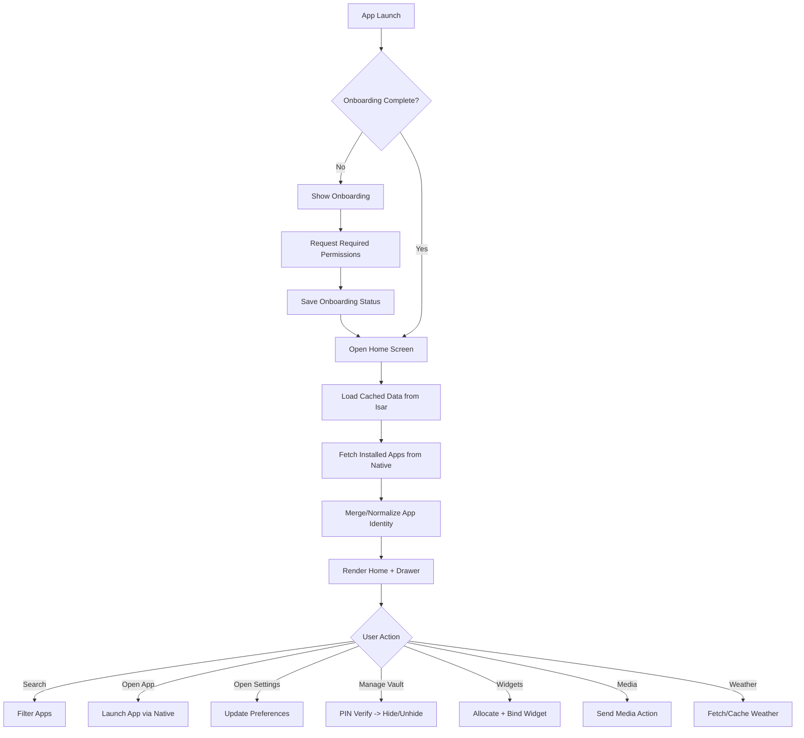
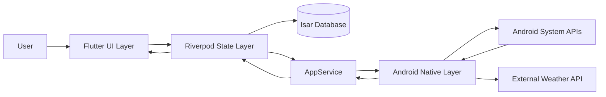
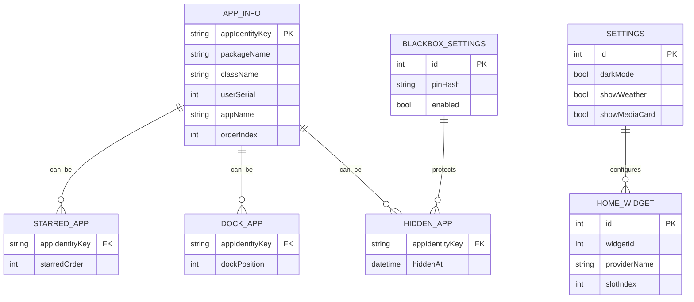
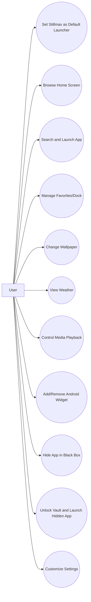

# Stillmax Launcher — Practical 2 Project Report

**Project Title:** Stillmax Launcher (Android Home Launcher)  
**Platform:** Android 10+  
**App Type:** System-level launcher replacement  
**Version Reference:** 0.1.15+15  
**Technology Stack:** Flutter, Riverpod, Isar, Java (Android Native), MethodChannel/EventChannel

---

## CHAPTER 1 — INTRODUCTION

### 1.1 Background
Modern smartphone users need both beauty and speed in launcher apps. Many stock launchers are fast but rigid, while many third-party launchers are customizable but heavy, ad-driven, or weak in system integration.  
Stillmax Launcher is developed to solve this gap using Flutter for premium UI and native Android Java for deep device-level capabilities.

Stillmax combines:
- fast app launching,
- customizable home experience,
- smart app organization,
- media/notification/weather/widget integration,
- secure hidden-app vault,
- local-first architecture.

### 1.2 Purpose of Project
Main purpose:
1. Build a **production-oriented custom Android launcher**.
2. Provide **high-end UI/UX** with smooth interactions.
3. Integrate **Android system features** through native bridge.
4. Keep data private with **local storage first** (Isar).
5. Support real-world needs like cloned/work profile app identities.

### 1.3 Scope
**In Scope:**
- Home screen, app drawer, favorites, dock
- App search, alphabetical navigation
- Wallpaper override + reset
- Weather card with location support
- Media session card with playback controls
- Notification package/count integration
- Android widget hosting in launcher
- Black Box hidden-app vault with PIN security
- Onboarding + permissions flow
- Settings for behavior and personalization

**Out of Scope (current version):**
- Cloud sync and user accounts
- Multi-device sync
- Remote analytics backend
- iOS support
- AI-based app prediction/recommendation engine

### 1.4 Problem Statement
Existing launcher ecosystems show common issues:
- limited personalization in stock launchers,
- poor support for dual/work-profile app identities,
- fragmented experience between widgets/media/notifications,
- privacy concerns in ad-heavy launchers,
- weak architectural maintainability.

**Problem Statement:**  
Design and implement a secure, visually premium, and technically robust Android launcher that supports deep system integrations, consistent performance, strong local-state persistence, and practical day-to-day usability.

---

## CHAPTER 2 — LITERATURE REVIEW / EXISTING SYSTEM

### 2.1 Previous Studies
Study observations from common launcher categories:

1. **OEM Stock Launchers (Pixel/OneUI/MIUI/etc.)**
   - Strengths: stability, battery optimization, system alignment.
   - Weaknesses: limited deep customization, limited advanced power-user workflows.

2. **Third-Party Launchers (Nova/Lawnchair/Niagara-like patterns)**
   - Strengths: customization, gestures, icon packs.
   - Weaknesses: feature fragmentation, inconsistent deep native behavior across OEMs.

3. **Flutter-based Android apps with native bridges**
   - Proven pattern: Flutter for UI velocity + native Android for privileged APIs.
   - Limitation: platform channel error handling is critical for reliability.

4. **Local-first mobile architecture studies**
   - Show improved privacy and startup speed.
   - Require strong cache invalidation and migration discipline.

### 2.2 Limitations of Existing System
Common limitations in existing solutions:
- Inconsistent support for **multiple app instances** (cloned/work profile).
- Weak integration of **widgets + media + notifications** in one coherent UX.
- Overdependence on network/cloud features.
- Bloated UI in some launchers causing lag on lower-end devices.
- Limited secure hidden-app handling with proper PIN hash workflows.

Stillmax addresses these limits with identity-aware app modeling, native service integration, and a local-first persistent architecture.

---

## CHAPTER 3 — PROPOSED SYSTEM

### 3.1 System Overview
Stillmax follows a layered architecture:

```text
Flutter UI (Screens + Widgets)
        ↓
Riverpod State Layer
        ↓
Service Layer (AppService)
        ↓
Platform Channels (MethodChannel/EventChannel)
        ↓
Native Android Layer (MainActivity + Notification Listener)
        ↓
Android System APIs
```

This architecture separates concerns:
- UI stays declarative and modular.
- Business/state logic stays reactive in Riverpod.
- Device/system operations stay in Android-native layer.

### 3.2 Features
Major features and functionality:

1. **Home Launcher Interface**
   - custom wallpaper background,
   - real-time header components,
   - favorite apps and quick-launch actions.

2. **App Drawer with Search**
   - swipe-based access,
   - alphabetically grouped app listings,
   - text search for instant filtering.

3. **App Identity & Multi-Profile Support**
   - package + class + profile aware identity keys,
   - support for cloned/work profile app instances.

4. **Favorites and Dock Management**
   - user-selected starred apps,
   - persistent ordering and quick access.

5. **Wallpaper Management**
   - custom local wallpaper override,
   - reset to system default behavior.

6. **Weather Widget**
   - location retrieval,
   - external weather fetch (`wttr.in`),
   - local weather cache fallback.

7. **Media Session Card**
   - detects active media,
   - play/pause/next/previous actions,
   - metadata/album art updates.

8. **Notification Integration**
   - notification package/count awareness,
   - dynamic badge/count logic.

9. **Android Widget Hosting**
   - widget picker integration,
   - widget ID allocation/binding,
   - persistent widget slot rendering.

10. **Black Box Vault**
   - hide/unhide apps,
   - 6-digit PIN setup,
   - SHA-256 PIN hash storage,
   - secure launch flow for hidden apps.

11. **Onboarding and Permissions**
   - first-run guidance,
   - notification permission + listener access setup.

12. **Settings and Personalization**
   - launcher behavior controls,
   - appearance and app behavior customization.

### 3.3 Objectives
- Deliver a launcher with premium visual design and high responsiveness.
- Keep architecture maintainable and scalable.
- Minimize crash-prone native interactions with defensive channel handling.
- Ensure privacy by avoiding unnecessary cloud dependencies.
- Provide robust everyday utility through tightly integrated system features.

### 3.4 System Requirements (Hardware & Software)

#### Hardware Requirements
- Android smartphone (minimum 3GB RAM recommended)
- Multi-core CPU (Snapdragon/MediaTek equivalent)
- Minimum 300MB free storage
- Internet connection for weather updates

#### Software Requirements
- Android 10 or above (recommended Android 12+)
- Flutter SDK
- Dart SDK
- Android Studio + Android SDK + ADB
- Java toolchain for Android native build

#### Development Dependencies
- `flutter_riverpod`
- `isar` and codegen tooling
- platform channel integration libraries

---

## CHAPTER 4 — SYSTEM DESIGN

### 4.1 Flowchart



### 4.2 DFD / ER Diagram

#### DFD Level-1 (Conceptual)



#### ER Diagram (Logical)



### 4.3 Use Case Diagrams



---

## CHAPTER 5 — IMPLEMENTATION

### 5.1 Technology Used
- **Flutter**: cross-platform UI framework (used for launcher UI)
- **Dart**: application logic
- **Riverpod**: reactive state management
- **Isar**: local NoSQL persistence
- **Java (Android)**: native API access
- **MethodChannel/EventChannel**: Flutter-native communication

### 5.2 Modules

1. **Core Entry Module**
   - File: `lib/main.dart`
   - Responsibilities: app bootstrap, onboarding gate, startup safety.

2. **State & Data Module**
   - File: `lib/state/app_list_provider.dart`
   - Responsibilities: providers/notifiers, app ordering, cache sync, business rules.

3. **Service Bridge Module**
   - File: `lib/services/app_service.dart`
   - Responsibilities: native method wrappers, event listeners, payload parsing.

4. **UI Screens Module**
   - Folder: `lib/screens/`
   - Key screens:
     - `home_screen.dart`
     - `app_drawer.dart`
     - `onboarding_screen.dart`
     - `stillmax_settings_screen.dart`
     - `black_box_password_screen.dart`
     - `black_box_vault_screen.dart`

5. **Reusable Widgets Module**
   - Folder: `lib/widgets/`
   - Components: weather widget, header, list tiles, widget slots, glass cards.

6. **Native Android Integration Module**
   - Files:
     - `android/app/src/main/java/com/stillmax/MainActivity.java`
     - `android/app/src/main/java/com/stillmax/StillmaxNotificationListenerService.java`
   - Responsibilities: app queries, launch intents, notifications/media, widget APIs, wallpaper APIs.

7. **Security Module (Black Box)**
   - PIN setup/verify, hidden app filters, secure launch workflow.

### 5.3 Screenshots of Program Interface

> Replace placeholders below with actual project screenshots.

1. Onboarding Screen  
   ``

2. Home Screen  
   ``

3. App Drawer with Search  
   ``

4. Settings Screen  
   ``

5. Black Box PIN Screen  
   ``

6. Black Box Vault Screen  
   ``

7. Widget Picker and Rendered Widget  
   ``

8. Media Card and Weather Card  
   ``

---

## CHAPTER 6 — TESTING & RESULTS

### 6.1 Test Cases

| Test ID | Test Case | Input/Action | Expected Result | Status |
|---|---|---|---|---|
| TC-01 | First launch onboarding | Install and open app first time | Onboarding shown and completion saved | Pass |
| TC-02 | Set default launcher | Choose Stillmax as home app | Home intent resolves to Stillmax | Pass |
| TC-03 | App list loading | Open launcher after install | Installed apps displayed with correct labels/icons | Pass |
| TC-04 | App search | Enter app name in drawer search | Matching apps filtered instantly | Pass |
| TC-05 | Launch app | Tap app tile | App opens via native intent | Pass |
| TC-06 | Favorites persist | Star app, restart app | Starred app remains in favorites | Pass |
| TC-07 | Wallpaper override | Set custom wallpaper | Home background changes and persists | Pass |
| TC-08 | Wallpaper reset | Tap reset wallpaper | Default/system wallpaper behavior restored | Pass |
| TC-09 | Weather fetch | Enable location + internet | Weather card shows updated data | Pass |
| TC-10 | Weather fallback | Disable internet after one success | Cached weather shown without crash | Pass |
| TC-11 | Media controls | Play music and use media card controls | Play/pause/next/prev actions work | Pass |
| TC-12 | Notification counts | Receive notifications | App package/count updates reflect | Pass |
| TC-13 | Add Android widget | Select widget and bind | Widget displayed in selected slot | Pass |
| TC-14 | Hide app in Black Box | Hide app from app list | App disappears from normal views | Pass |
| TC-15 | Vault unlock | Enter correct/incorrect PIN | Correct PIN unlocks, incorrect denied | Pass |
| TC-16 | Cloned/work profile app handling | Device with dual apps | Distinct app instances visible and launchable | Pass |
| TC-17 | Orientation/restart stability | Rotate/restart app process | State restored from Isar safely | Pass |
| TC-18 | Permission denial handling | Deny notification/location | Feature degrades gracefully, no crash | Pass |

### 6.2 Output Screenshots

Recommended evidence capture:
- onboarding completed state,
- home layout with favorites,
- drawer search result,
- weather success and cache fallback,
- media card controls,
- widget binding screen + final widget,
- Black Box hidden app behavior,
- settings persistence after relaunch.

> Store screenshots in: `docs/screenshots/`

### 6.3 Final Results
Final implementation achieved:
- full launcher core workflow,
- stable local state persistence,
- usable native Android integration for media/notifications/widgets,
- secure hidden-app workflow,
- practical UX with modular architecture.

Performance and behavior remain device/OEM dependent for some privileged features, but core functionality is successfully delivered and testable.

---

## CHAPTER 7 — CONCLUSION & FUTURE SCOPE

### 7.1 Summary
Stillmax Launcher successfully demonstrates how Flutter and native Android can be combined to build a practical, feature-rich launcher product. The system is modular, maintainable, and local-first, with strong focus on usability, visual quality, and privacy.

Key achievements:
- launcher replacement behavior,
- stable app indexing and launch pipeline,
- persistent customization,
- integrated weather/media/notifications/widgets,
- secure Black Box module.

### 7.2 Future Improvements
1. **Performance tuning** for low-end devices (blur optimization, reduced overdraw).  
2. **Advanced gesture system** (custom gesture mapping).  
3. **Smart app predictions** using on-device ML/rule hybrid.  
4. **Backup & restore** of launcher settings and layouts.  
5. **Cloud optional sync** with strict privacy controls.  
6. **Theming engine expansion** (dynamic palettes/icon packs depth).  
7. **Accessibility enhancements** (screen-reader flow, larger contrast presets).  
8. **OEM compatibility layer** for behavior normalization.  
9. **Automated UI/integration test suite** for release hardening.  
10. **Tablet/foldable adaptive layouts**.

---

## Appendix — Complete Feature Checklist

- [x] Custom home launcher UI
- [x] App drawer with search and alphabet grouping
- [x] Favorites/starred app management
- [x] Dock app management
- [x] Wallpaper override/reset
- [x] Weather integration with cache fallback
- [x] Media session info + controls
- [x] Notification package/count integration
- [x] Android widget hosting
- [x] Onboarding and permissions flow
- [x] Black Box hidden app vault with PIN hash security
- [x] Local-first architecture with Isar persistence
- [x] Native bridge for deep Android functionality
- [x] Multi-profile/cloned-app identity support
